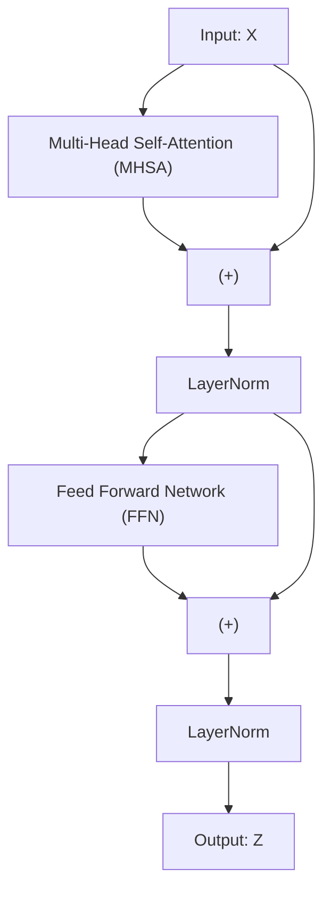

# 数学建模

## 0. 问题定义

单细胞RNA测序数据（scRNA-seq）是现代生物学研究中的一项重要技术，它允许我们同时测量数千个细胞中数千个基因的表达水平。scRNA-seq数据通常以矩阵的形式表示，其中行代表细胞，列代表基因。scRNA-seq数据中，每个细胞的基因表达量是离散的值，通常是0或1，或者是一个连续的值。

## 1. 数据表示

单细胞RNA测序数据可以表示为一个矩阵 $\mathbf{X} \in \mathbb{R}^{n \times g}$，其中：
- $n$ 是细胞数量
- $g$ 是基因数量  
- $x_{i,j}$ 表示第 $i$ 个细胞中第 $j$ 个基因的表达量

对于每个细胞 $i$，我们有基因表达向量 $\mathbf{x}_i = [x_{i,1}, x_{i,2}, ..., x_{i,g}]^T$。

## 2. 模型设计

### 2.1 Embedding

Embedding的输入是离散的符号，输出是连续的向量。Embedding的输出向量通常用于神经网络的输入层，也可以用于神经网络的隐藏层。

#### 2.1.1 Gene Embedding分支

Gene Embedding分支专注于捕捉基因的内在生物学特性和基因间的调控关系：

$$\mathbf{E}_{gene} = f_{gene}(\mathbf{G}) \in \mathbb{R}^{g \times d}$$

其中：
- $\mathbf{G} = [g_1, g_2, ..., g_g]$ 是基因ID序列
- $d$ 是嵌入维度
- 每个基因 $g_j$ 对应一个可学习的向量 $\mathbf{e}^{gene}_{j} \in \mathbb{R}^d$

这个分支学习基因的语义表示，包括：
- **功能相似性**：功能相关的基因在嵌入空间中距离较近
- **通路关系**：同一生物学通路的基因具有相似的表示
- **调控关系**：转录因子与其靶基因之间的关系

#### 2.1.2 Expression Embedding分支

Expression Embedding分支专注于捕捉表达量的数值特征和上下文依赖：

$$\mathbf{E}_{expr} = f_{expr}(\mathbf{x}) \in \mathbb{R}^{g \times d}$$

其中：
- $f_{expr}$ 是表达量编码函数
- $\mathbf{x} = [x_1, x_2, ..., x_g]$ 是表达量向量
- $\mathbf{e}^{expr}_{j} \in \mathbb{R}^d$ 是第 $j$ 个基因的表达量嵌入向量

考虑到scRNA-seq数据的特点，我们设计分层编码策略：

**Step 1: 表达量归一化与离散化**
$$\tilde{x}_{j} = \text{log}(x_{j} + 1)$$
$$b_{j} = \text{Discretize}_{N}(\tilde{x}_{j})$$

**Step 2: 分层表达嵌入**
$$\mathbf{e}^{expr}_{j} = \mathbf{W}_{bin} \cdot \text{OneHot}_{N}(b_{j}) + \alpha \cdot \tilde{x}_{j} \cdot \mathbf{v}_{cont}$$

其中：
- $\mathbf{W}_{bin} \in \mathbb{R}^{d \times \text{}}$ 是离散表达水平的嵌入矩阵
- $\mathbf{v}_{cont} \in \mathbb{R}^d$ 是连续值的投影向量
- $\alpha$ 是平衡离散和连续特征的权重参数
- $N$ 是离散化的bin数量

## 2.2 双分支Transformer架构

### 2.2.1 传统的Transformer架构

#### 2.2.1.1 传统的Transformer Block

传统的，标准的Transformer Block包括：

- Multi-Head Self-Attention层
- Add & Norm（残差连接 + LayerNorm）
- Position-wise Feed-Forward Network (FFN)
- 再次 Add & Norm



具体流程：

1. Multi-Head Self-Attention层和残差和归一化

$$
\mathbf{Y} = \text{LayerNorm}\big(\mathbf{X} + \text{MHSA}(\mathbf{X})\big)
$$

2. 前馈网络子层和残差和归一化

$$
\mathbf{Z} = \text{LayerNorm}\big(\mathbf{Y} + \text{FFN}(\mathbf{Y})\big)
$$

FFN一般是两个线性层和一个激活函数（通常是ReLU或GELU）：

$$
\text{FFN}(\mathbf{Y}) = \max(0, \mathbf{Y} \mathbf{W}_1 + \mathbf{b}_1) \mathbf{W}_2 + \mathbf{b}_2
$$

其中

$$
\mathbf{W}_1 \in \mathbb{R}^{d \times d_{ff}}, \quad \mathbf{W}_2 \in \mathbb{R}^{d_{ff} \times d}
$$

$( d_{ff} )$ 通常比 $( d )$ 大，比如4倍。


#### 2.2.1.2 多头自注意力机制 Multi-Head Self-Attention (MHSA)

多头自注意力机制 Multi-Head Self-Attention (MHSA)的核心思想是将输入映射为多组查询（Query）、键（Key）、值（Value），分别计算注意力，然后拼接输出。

假设输入是序列长度为 $( n )$，每个元素是维度为 $( d )$ 的向量，输入矩阵为：

$$
\mathbf{X} \in \mathbb{R}^{n \times d}
$$

- 头数为 $( h )$
- 每个头的维度为 $( d_k = d / h )$，其中 $( d )$ 是维度

对于第 $( i )$ 个头，有三个权重矩阵：

$$
\mathbf{W}_i^Q, \mathbf{W}_i^K, \mathbf{W}_i^V \in \mathbb{R}^{d \times d_k}
$$

将输入 $( \mathbf{X} )$ 分别映射为查询、键、值矩阵：

$$
\mathbf{Q}_i = \mathbf{X} \mathbf{W}_i^Q \in \mathbb{R}^{n \times d_k}
$$
$$
\mathbf{K}_i = \mathbf{X} \mathbf{W}_i^K \in \mathbb{R}^{n \times d_k}
$$
$$
\mathbf{V}_i = \mathbf{X} \mathbf{W}_i^V \in \mathbb{R}^{n \times d_k}
$$

$$
\mathbf{A}_i = \text{softmax}\left(\frac{\mathbf{Q}_i \mathbf{K}_i^\top}{\sqrt{d_k}}\right) \in \mathbb{R}^{n \times n}
$$

这里 $\frac{1}{\sqrt{d_k}}$ 是缩放因子，防止点积过大导致梯度消失。

计算注意力输出

$$
\mathbf{Z}_i = \mathbf{A}_i \mathbf{V}_i \in \mathbb{R}^{n \times d_k}
$$

拼接所有头的输出,将所有头的输出按特征维度拼接：

$$
\mathbf{Z} = \text{Concat}(\mathbf{Z}_1, \mathbf{Z}_2, \ldots, \mathbf{Z}_h) \in \mathbb{R}^{n \times d}
$$

然后通过一个线性变换：

$$
\text{MHSA}(\mathbf{X}) = \mathbf{Z} \mathbf{W}^O, \quad \mathbf{W}^O \in \mathbb{R}^{d \times d}
$$

### 2.3 双分支Transformer架构

我们将采样Multi-Head Latent-Attention (MHLA)的机制，来实现基因编码分支和表达量编码分支的注意力机制。但是，为了简化建模描述，我们只讨论其中的Attention机制。

#### 2.3.1 初始化基因和表达的编码

结合生物学背景，我们考虑基因编码信息和表达量编码信息的双分支的注意力机制，并引入生物学约束的注意力权重。其中，基因编码分支的注意力机制只考虑基因编码信息，表达量编码分支的注意力机制表达量编码信息以外还考虑基因调控信息（从基因编码分支的注意力机制中提取）。

首先，我们初始化基因编码分支和表达量编码分支的隐藏状态：

$$\mathbf{H}_{gene}^{(0)} = \mathbf{E}_{gene}$$ 

$$\mathbf{H}_{expr}^{(0)} = \mathbf{E}_{expr}$$

然后，新基因编码分支和表达量编码分支的隐藏状态，多头注意力机制的计算过程如下：

#### 2.2.2 基因编码分支

在模型训练时，Attention 矩阵 $\mathbf{A}$ 学习token之间的注意力权重，可以看作隐式学习到的基因调控关系的近似。

**_但 $\mathbf{A}$ 是经过 Softmax 归一化且非负的，不直接包含负调控信息，并且基因调控是一个稀疏的矩阵。因此，需要设计方法让模型能够表达激活（正调控）与抑制（负调控）两类关系，并且能够学习到基因调控的稀疏性。_**

因此，我们特别设计了 L0 正则化 和 门控机制 能让模型表达“正/负/无调控”三种生物关系，并保证稀疏性。

对于第 $( l )$ 层，基因编码的隐藏状态是 $\mathbf{H}_{gene}^{(l)}$，表达量编码的隐藏状态是 $\mathbf{H}_{expr}^{(l)}$。我们先计算基因编码的Q,K,V矩阵：

$$\mathbf{Q}_{gene} = \mathbf{H}_{gene}^{(l)} \cdot \mathbf{W}^{Q}_{gene}$$
$$\mathbf{K}_{gene} = \mathbf{H}_{gene}^{(l)} \cdot \mathbf{W}^{K}_{gene}$$
$$\mathbf{V}_{gene} = \mathbf{H}_{gene}^{(l)} \cdot \mathbf{W}^{V}_{gene}$$

一、L0 正则化和门控机制
1. 什么是L0正则化？
  L0范数($\|\theta\|_0$)代表一个参数向量（比如神经网络权重）中非零元素的个数，即有多少个参数是“起作用”的。
  L0正则化就是鼓励参数中有尽可能多的元素是零，直接让网络变稀疏。
  L0正则化损失函数如下，其中，$L\big(\cdot\big)$是常规的损失函数，$\lambda$ 是正则化系数：
  $$
  R(\theta) = \frac{1}{N} \sum_{i=1}^N L\big(f_{\theta}(x_i), y_i\big) + \lambda \|\theta\|_0
  $$

2. 门控机制
  对每个参数$\theta_j$引入一个二值“门”$z_j$，只有门“开”时（$z_j=1$）参数才生效，否则为零：
  $$
  \theta_j = \hat{\theta}_j z_j, \quad z_j \in \{0,1\}
  $$
  将$z_j$视为伯努利分布（Bernoulli）的随机变量，使用参数化的概率$\pi_j$。
  优化目标变成最小化所有门“开”的概率和，以及相应的损失, $\odot$代表逐元素相乘：

  $$
  R(\hat{\theta}, \pi) = \mathbb{E}_{q(z|\pi)}\left[\frac{1}{N} \sum_{i} L\big(f_{\hat{\theta} \odot z}(x_i), y_i\big)\right] + \lambda \sum_j \pi_j
  $$


3. 核心创新：可微的L0正则化

由于伯努利分布的门不可微，作者使用了连续随机变量$s$，“门”$z$通过硬化的sigmoid变换得到，
$s$来自某种可微分的分布$q(s|\phi)$，这样整个优化目标对分参数$\phi$可微：
  $$
  z = \min(1, \max(0, s))
  $$

  $$
  q(z \neq 0|\phi) = 1 - Q(s \leq 0|\phi)
  $$
  
  即门被激活的概率 = 随机变量大于0的概率（$Q$是累计分布函数）。
  
  新的损失近似目标，其中$g(\cdot)$是硬sigmoid函数：

$$
R(\hat{\theta}, \phi) = \mathbb{E}_{q(s|\phi)}\left[\frac{1}{N}\sum_i L\big(f_{\hat{\theta} \odot g(s)}(x_i), y_i\big)\right] + \lambda \sum_j (1 - Q(s_j \leq 0|\phi_j))
$$
  


我们的设计：

$$
\mathbf{A}_{gene}^{i, j} = \text{softmax}\left(\frac{\mathbf{Q}_{gene, i} \mathbf{K}_{gene, j}^\top}{\sqrt{d_k}}\right) \in \mathbb{R}^{n \times n}
$$

其中，$\mathbf{Q}_{gene, i}$ 是第 $( i )$ 个基因的查询向量，$\mathbf{K}_{gene, j}$ 是第 $( j )$ 个基因的键向量。


```citation
@article{louizos2017learning,
  title={Learning sparse neural networks through $ L\_0 $ regularization},
  author={Louizos, Christos and Welling, Max and Kingma, Diederik P},
  journal={arXiv preprint arXiv:1712.01312},
  year={2017}
}
```

$$
\mathbf{Z}_{gene} = \mathbf{A}_{gene} \mathbf{V}_{gene} \in \mathbb{R}^{n \times d_k}
$$

## 3. 预训练

多任务训练，包括：

- 基因编码分支的预训练（Gene Embedding）
- 表达量编码分支的预训练（Expression Embedding）
- 基因编码分支和表达量编码分支的联合训练（Joint Training）

### 3.1 基因编码分支的预训练

通过对比学习的方法，学习表达的基因和为表达基因的语义表示。假设，同时表达的基因之间应该具有更多的相关性，而和未表达的基因应该具有更少的相关性，则可以表达的基因为正样本，未表达的基因为负样本。

给定一个细胞，有表达的基因ID为 $\mathbf{G} = \{g_1, g_2, ..., g_N\}$，和表达量矩阵 $\mathbf{X} = \{x_1, x_2, ..., x_N\}$，我可以构造正样本和负样本。

- 正样本

随机采样 $k$ 个index $\mathbf{P} = \{p_1, p_2, ..., p_k\}$，然后将这个位置的基因ID替换成”【MASK】“ token。$\mathbf{G}_{+} = \{g_{p_1}, g_{p_2}, ..., g_{p_k}\}$，则 $\mathbf{G}_{+}$ 为正样本。

随机采样 $b \times k$ 个index $\mathbf{G}_{-} = \{g_{n_1}, g_{n_2}, ..., g_{n_{b \times k}}\}$，则 $\mathbf{G}_{-}$ 为负样本。

通过模型之后，我们可以通过"[CLS]" token的输出作为anchor，然后通过余弦相似度计算正样本和负样本的相似度，通过InfoNCE损失函数计算损失。

$$
\mathcal{L}_{gene} = \text{InfoNCE}(f_{gene}([\mathbf{G}, \mathbf{G}_{-}, \mathbf{G}_{+}])
$$
